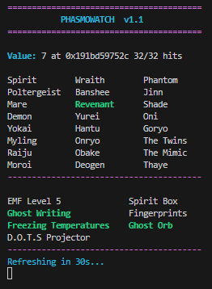

# Phasmowatch

Phasmowatch is a small Python tool that reads memory data from the game **Phasmophobia** to show which ghost is active and what evidences matches it
It’s made as a project for learning about how memory reading works

## What it does
- Connects to the Phasmophobia process.
- Reads a ghost ID value from memory using collected pointers collected from `pointers.xml`
- Shows the ghost type and evidence highlighting it in a chart

   
  <em>Example terminal output</em>

### Example pointers.xml:
<Pointers>
  <CheatEntry>
    <Address>"GameAssembly.dll+0x123456"</Address>
    <Offsets>
      <Offset>0x10</Offset>
      <Offset>0x20</Offset>
      <Offset>0x8</Offset>
    </Offsets>
  </CheatEntry>
</Pointers>

## Other
This tool is for educational or testing purposes only
It is not meant for gaining unfair advantages over other players
Use it responsibly locally
The creator is not responsible for misuse or violations of game terms

Free to use and modify for learning or research
